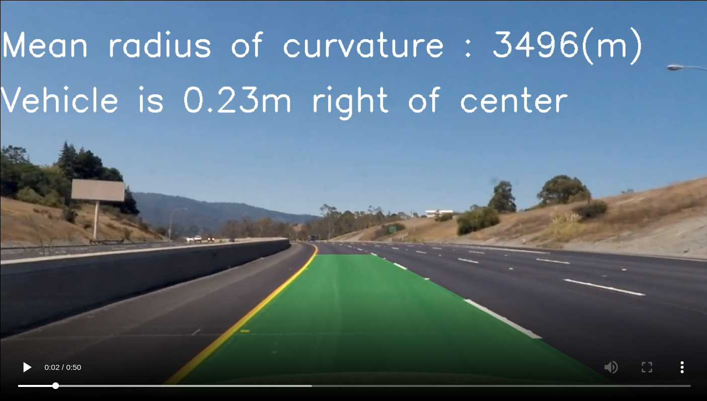
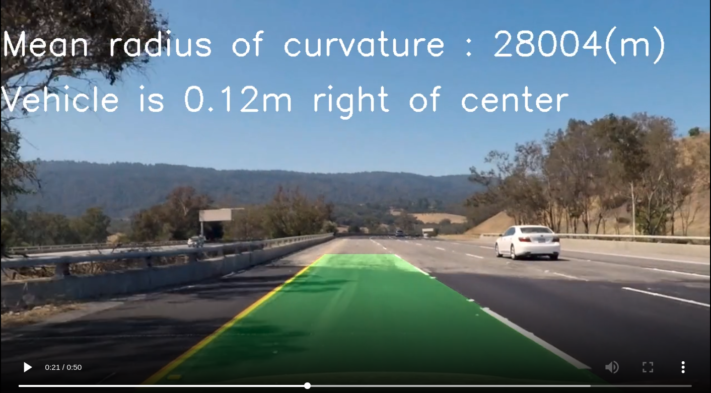
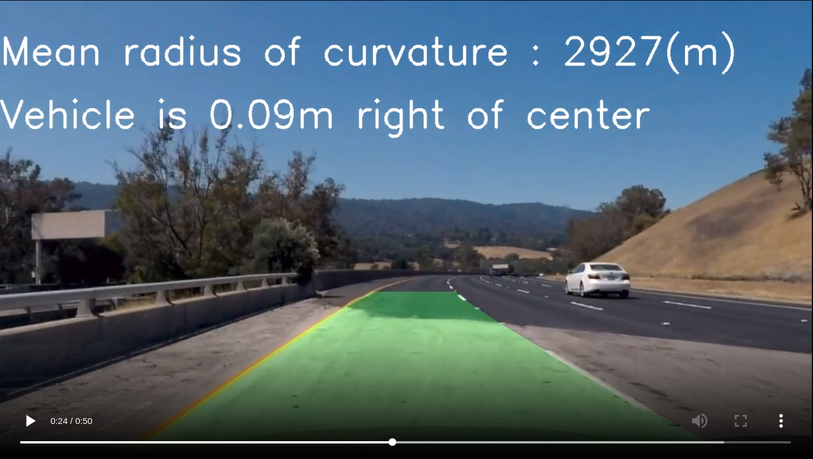
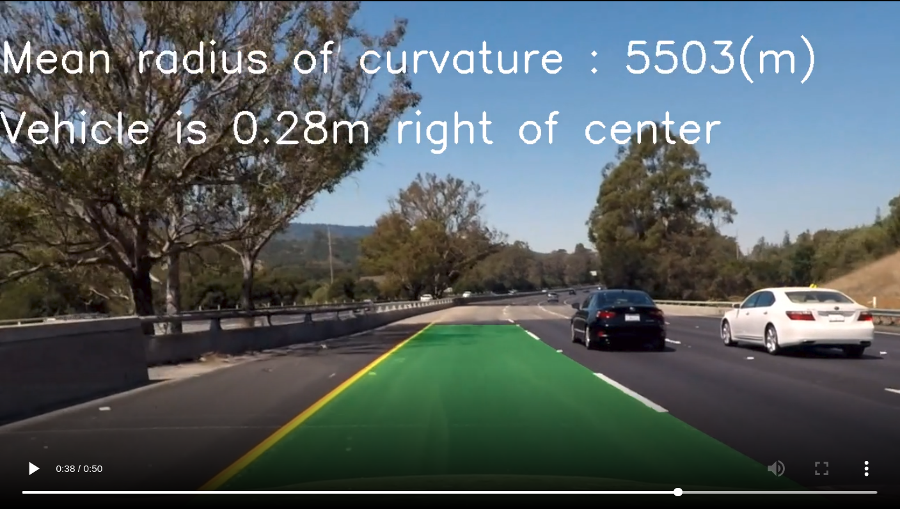
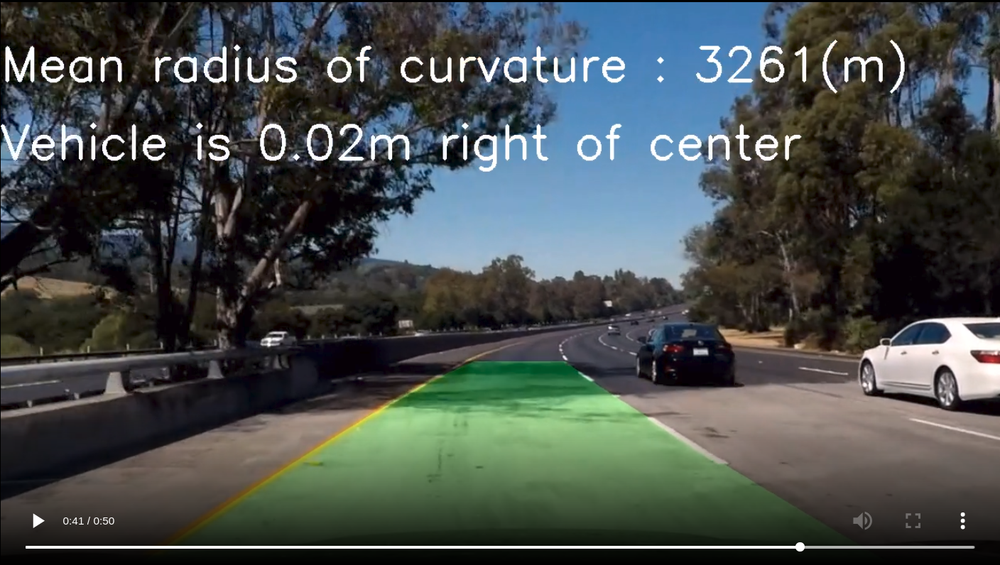

## Advanced Lane Finding
### Udacity Nanodegree Program

The Project
---

The goals / steps of this project are the following:

* Compute the camera calibration matrix and distortion coefficients given a set of chessboard images.
* Apply a distortion correction to raw images.
* Use color transforms, gradients, etc., to create a thresholded binary image.
* Apply a perspective transform to rectify binary image ("birds-eye view").
* Detect lane pixels and fit to find the lane boundary.
* Determine the curvature of the lane and vehicle position with respect to center.
* Warp the detected lane boundaries back onto the original image.
* Output visual display of the lane boundaries and numerical estimation of lane curvature and vehicle position.

The images for camera calibration are stored in the folder called `camera_cal`.  The images in `test_images` are for testing the pipeline on single frames.   

One complete pipeline output for test image is saved in `output_images`, and includes a description in the writeup for the project of what each image shows.    For the video called `project_video.mp4`, the resulting video output is in `output_images/project_video.mp4`. Sample snapshots of video output

